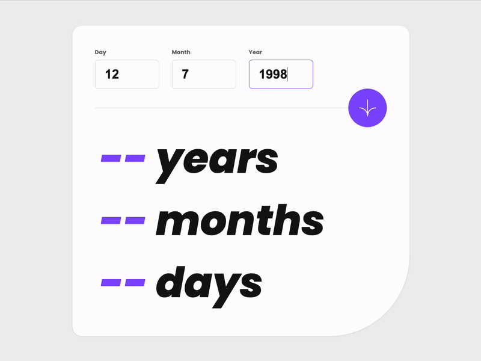

# Age Calculator App Solution

This is a solution to the [Age calculator app challenge on Frontend Mentor](https://www.frontendmentor.io/challenges/age-calculator-app-dF9DFFpj-Q).



## Project Overview

The "Age Calculator" is a simple yet elegant web application designed to calculate the user's age based on their input of date of birth. The application is implemented with a clean user interface that allows users to input their day, month, and year of birth. Upon submission, the application calculates and displays the age in years, months, and days, accompanied by a visually appealing progressive number animation.

The project is entirely written in HTML, CSS, and vanilla JavaScript, with no reliance on third-party libraries. This ensures lightweight pages and straightforward maintainability. Vite is used as the build tool to serve and bundle the project for production.

## Deployment

- Solution URL: [Frontend Mentor](https://www.frontendmentor.io/solutions/age-calculator-app-O96DuKwvEm)
- Live Site URL: [https://ionstici.github.io/age-calculator-app-fem/](https://ionstici.github.io/age-calculator-app-fem/)

The application is hosted on GitHub Pages, and was deployed using the [gh-pages](https://www.npmjs.com/package/gh-pages) package.

## Features

- Input fields for day, month, and year of birth.
- Progressive number animation to dynamically display age in years, months, and days.
- Responsive design for various screen sizes.
- Clean and modern user interface.
- No third-party libraries, pure HTML, CSS, and JavaScript implementation.
- Fast loading times due to Vite’s optimized bundling.

## How to Use

1. Enter your date of birth using the day, month, and year input fields.
2. Click on the calculate button (indicated by a downward arrow).
3. View your age, displayed as the number of years, months, and days, animated from 0 to the calculated age.

## Main Personal Objectives

- Try to use GitHub features such as "Issues", "Pull Requests", "Actions", "Projects" as much as possible.
- Write a comprehensive README documentation of the project.
- Set up a branch strategy and review your code before every merge onto `main`.
- Focus on the management aspects of the development process.

## Installation

To set up the project locally, follow these steps:

```bash
# Clone the repository to your local machine:
git clone https://github.com/ionStici/age-calculator-app-fem.git

cd age-calculator-app-fem # navigate to the project directory

npm install # install the dependencies

npm run dev # run the app in development mode

npm run build # build the application for production
```

## Development

The application consists of the following primary files:

- `index.html` : The entry point of the application containing the structure.
- `src/styles.css` : Contains all the styling rules for the application.
- `src/scripts.js` : The core JavaScript file that handles the logic for age calculation and number animation.

## Support

For any additional questions or support, please open an issue in the project's GitHub repository issue tracker.

## License

This project is licensed under the MIT License - see the [LICENSE.md](LICENSE) file for details.

## Contact

- [Ion Stici : GitHub Profile](https://github.com/ionStici)

<!--

## Styles

### Primary Colors

- Purple: hsl(259, 100%, 65%)
- Light red: hsl(0, 100%, 67%)

### Neutral Colors

- White: hsl(0, 0%, 100%)
- Off white: hsl(0, 0%, 94%)
- Light grey: hsl(0, 0%, 86%)
- Smokey grey: hsl(0, 1%, 44%)
- Off black: hsl(0, 0%, 8%)

## Typography and Font

- Font size (inputs): 32px
- Family: [Poppins](https://fonts.google.com/specimen/Poppins)
- Weights: 400i, 700, 800i

-->
